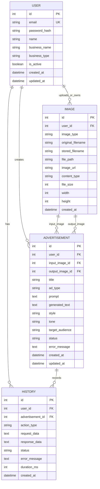

# DB ERD

초기 MVP 데이터베이스는 사용자, 이미지, 광고 생성 결과, 사용 이력을 중심으로 구성합니다. SQLite를 기본 데이터베이스로 사용하며, 운영 환경에서는 트래픽과 동시성 요구에 따라 PostgreSQL 전환을 검토할 수 있습니다.

```mermaid
erDiagram
    USER ||--o{ IMAGE : uploads_or_owns
    USER ||--o{ ADVERTISEMENT : creates
    USER ||--o{ HISTORY : has
    IMAGE ||--o{ ADVERTISEMENT : input_image
    IMAGE ||--o{ ADVERTISEMENT : output_image
    ADVERTISEMENT ||--o{ HISTORY : records

    USER {
        int id PK
        string email UK
        string password_hash
        string name
        string business_name
        string business_type
        boolean is_active
        datetime created_at
        datetime updated_at
    }

    IMAGE {
        int id PK
        int user_id FK
        string image_type
        string original_filename
        string stored_filename
        string file_path
        string image_url
        string content_type
        int file_size
        int width
        int height
        datetime created_at
    }

    ADVERTISEMENT {
        int id PK
        int user_id FK
        int input_image_id FK
        int output_image_id FK
        string title
        string ad_type
        text prompt
        text generated_text
        string style
        string tone
        string target_audience
        string status
        text error_message
        datetime created_at
        datetime updated_at
    }

    HISTORY {
        int id PK
        int user_id FK
        int advertisement_id FK
        string action_type
        text request_data
        text response_data
        string status
        text error_message
        int duration_ms
        datetime created_at
    }
```
